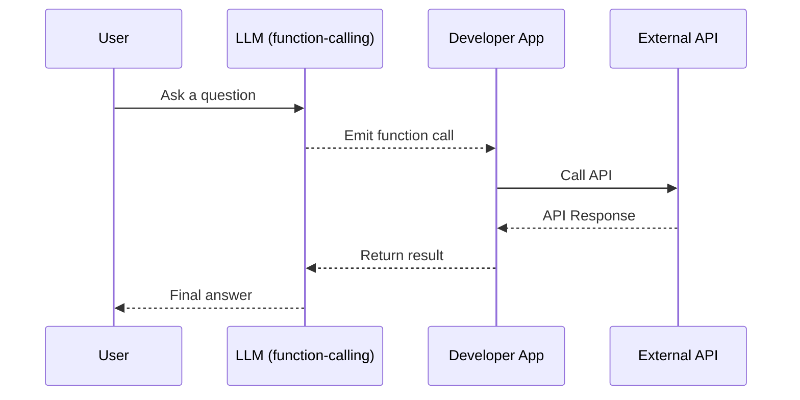
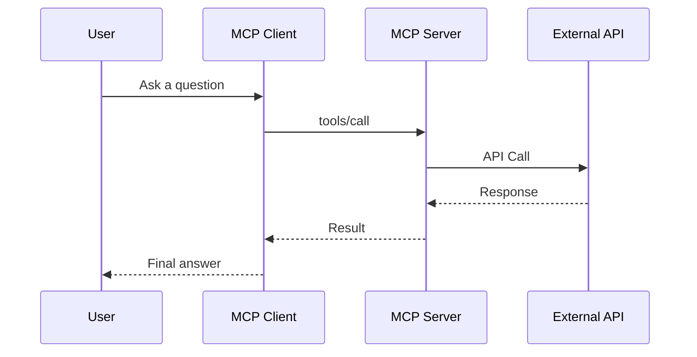
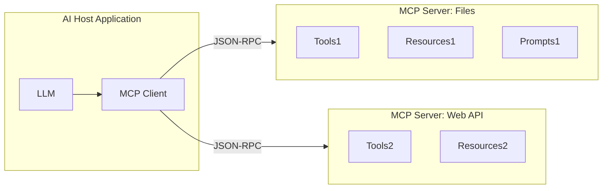
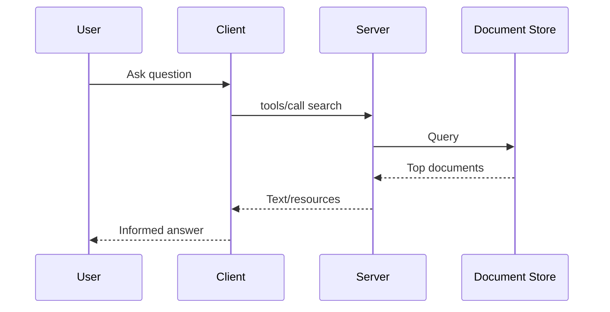

---
authors:
- muhammad
categories:
- LLMs
- Agents
comments: false
date: 2025-03-31
description: Model Context Protocol (MCP) - A Quick Intro
tags:
- agents
- llm
- architecture
- mcp
---

# Model Context Protocol (MCP) - A Quick Intro

## Introduction

### What is MCP?

The **Model Context Protocol (MCP)** is an open, standardized protocol introduced by Anthropic that bridges AI models with external data sources, tools, and services. Think of MCP like a **"USB-C for AI applications"** – it provides a universal adapter for connecting AI assistants to various content repositories, business tools, code environments, and APIs. By defining a common interface (built on JSON-RPC 2.0) for communication, MCP enables large language models (LLMs) to **invoke functions, retrieve data, or use predefined prompts** from external systems in a consistent and secure way.

### Purpose and Problem Addressed

MCP was designed to solve a major integration challenge often called the "M×N problem" in AI development. Traditionally, integrating *M* different LLMs with *N* different tools or data sources required custom connectors for each combination – a combinatorial explosion of ad-hoc code. This meant AI systems were largely **isolated from live data**, trapped behind information silos unless developers painstakingly wired in each external API or database.

MCP addresses this by providing **one standardized "language" for all interactions**. Developers can create one MCP-compliant interface for a data source or tool, and *any* MCP-enabled AI application can connect to it. This open standard replaces fragmented one-off integrations with a sustainable ecosystem of compatible clients and servers.

The result is a simpler, more scalable way to give AI assistants access to the **fresh, relevant context** they need – whether it’s company documents, live databases, or web results.

MCP is **two-way and secure**: it enables LLMs to query data and perform actions, while allowing organizations to keep data access controlled. The protocol supports OAuth 2.1 for authentication, enabling safe and secure enterprise use.

## Comparison: MCP vs. Simpler Function-Calling APIs

| Feature | Function-Calling (e.g. OpenAI/Google) | MCP (Anthropic) |
|--------|----------------------------------------|------------------|
| **Scope** | Individual functions defined per-model | Unified interface for data, tools, and prompts |
| **Standardization** | Proprietary formats (OpenAI, Google) | Open JSON-RPC-based protocol |
| **Interoperability** | Model- and vendor-specific | Any LLM can talk to any MCP-compliant server |
| **State Management** | Stateless (single call-response) | Persistent sessions and complex workflows |
| **Security** | Developer-defined | Built-in auth flows (OAuth 2.1), user approval model |
| **Extensibility** | Requires custom code per function | Plug-and-play with reusable components |

### Mermaid: Function-Calling vs. MCP Workflow





## Core Components of MCP

### Server-Side Primitives

- **Resources** – Static or dynamic data sources exposed via URI (e.g. `file://`, `db://`).
- **Tools** – Executable functions the AI can call with structured inputs/outputs.
- **Prompts** – Predefined prompt templates or workflows returned as message sequences.

### Client-Side Primitives

- **Roots** – Contextual entry points (e.g. current workspace, folder, URL scope).
- **Sampling** – Allows servers to call back to the model via the client (used for chaining, agents).

### Mermaid: MCP Architecture



## Python Tutorial: Building an MCP Server

### Step 1: Install SDK

```bash
pip install mcp
```

### Step 2: Minimal Server

```python
from mcp.server.fastmcp import FastMCP
mcp = FastMCP("Demo Server")
mcp.serve()
```

### Step 3: Add a Tool

```python
@mcp.tool()
def add(a: int, b: int) -> int:
    return a + b
```

### Step 4: Add a Resource

```python
@mcp.resource("greet://{name}")
def greet(name: str) -> str:
    return f"Hello, {name}!"
```

### Step 5: Add a Prompt

```python
from mcp.server.fastmcp.prompts import base

@mcp.prompt()
def solve_math(problem: str) -> list[base.Message]:
    return [
        base.SystemMessage("You are a math assistant."),
        base.UserMessage(f"Solve: {problem}"),
        base.AssistantMessage("Let me show the steps...")
    ]
```

### Step 6: Run and Test

```bash
python server.py
mcp dev server.py
```

## Advanced Use Cases

### State Management
- Servers can hold state across requests (e.g. database session).
- Maintain open connections or cache results.

### Agent Frameworks
- LangChain supports converting MCP Tools into agent tools.
- Compatible with Claude, ChatGPT (via Agents SDK), etc.

### Retrieval-Augmented Generation (RAG)



### Multi-Modal Extensions
- Resources can serve images, audio, etc.
- Tools can control browsers, devices, cloud services.

### Security & Governance
- Human approval is built-in for risky actions.
- OAuth 2.1 support for secure resource access.

## Conclusion

MCP represents a new, open foundation for connecting AI to external tools and context. It standardizes how LLMs retrieve data, call functions, and use reusable prompts, making AI integration modular, scalable, and interoperable.

Anthropic’s open protocol is being adopted across the industry, enabling a future where AI assistants plug into the real world seamlessly — through one unified protocol.

