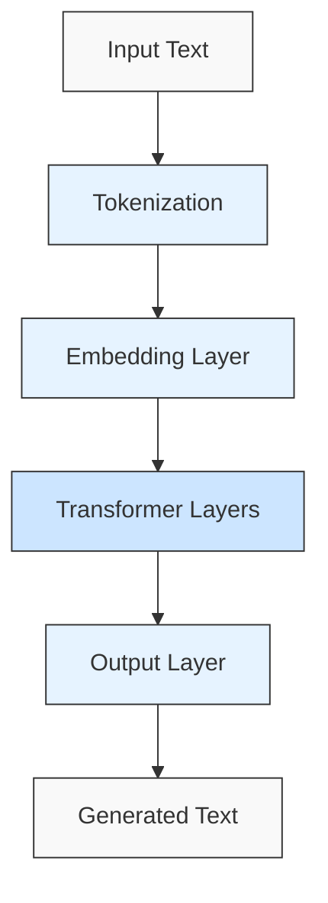
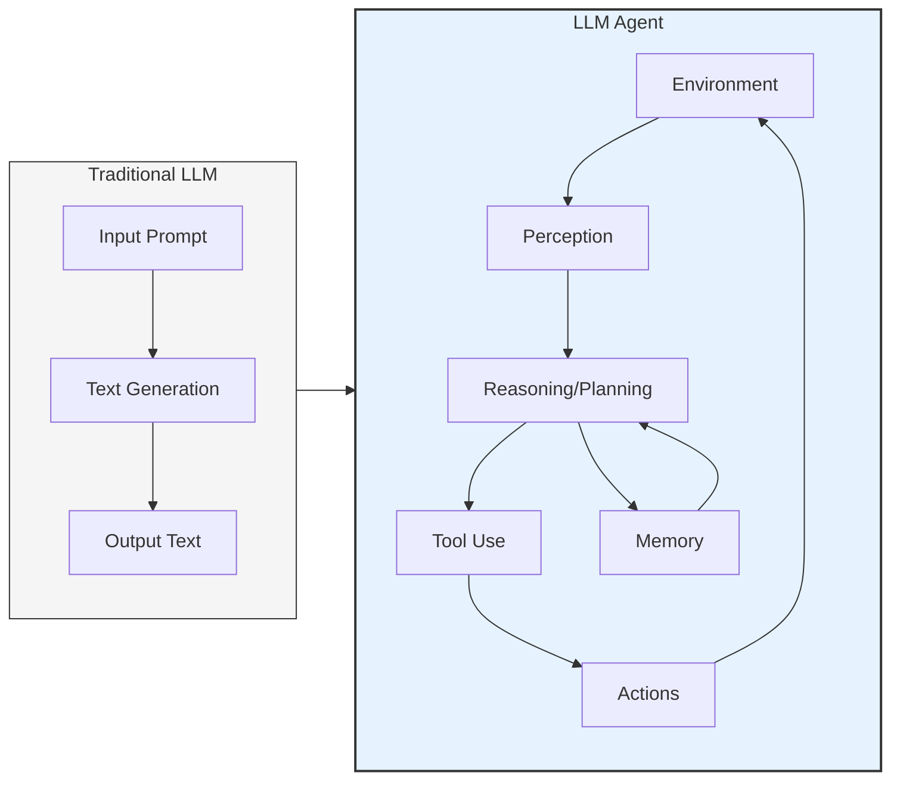
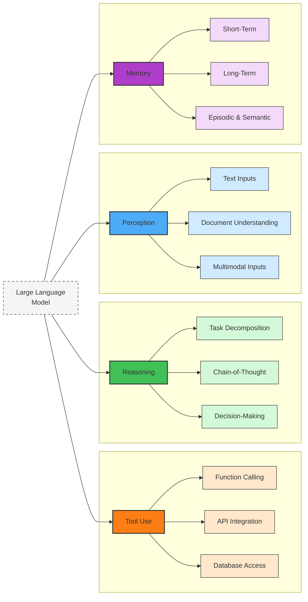
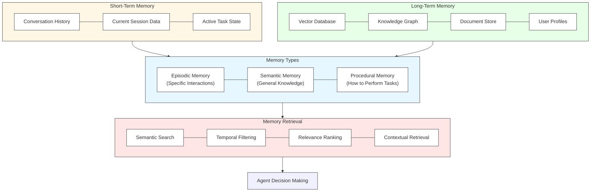
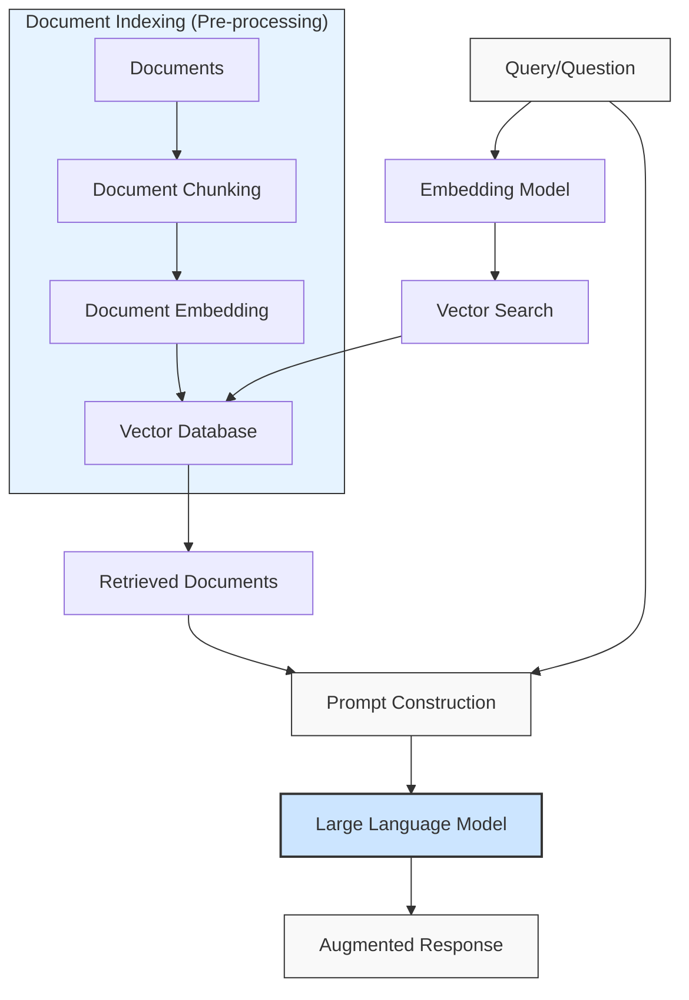
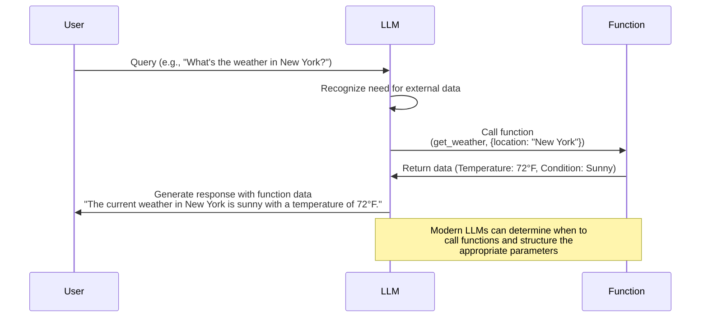
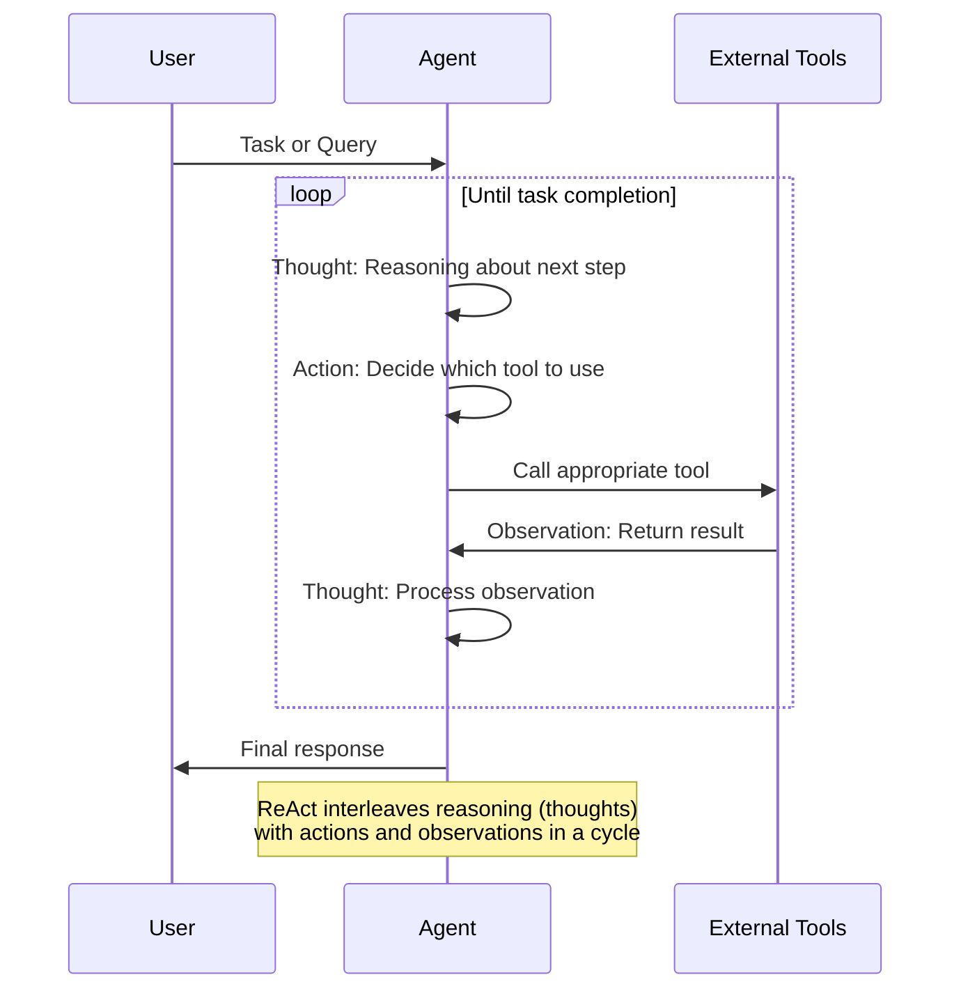
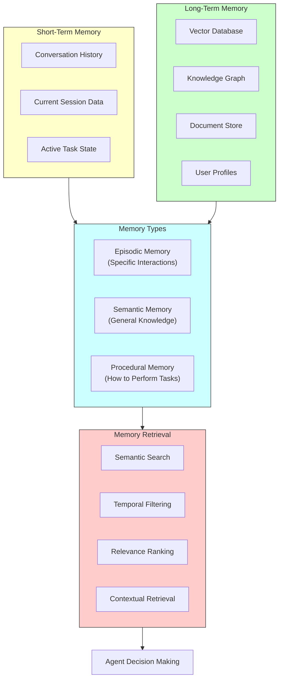
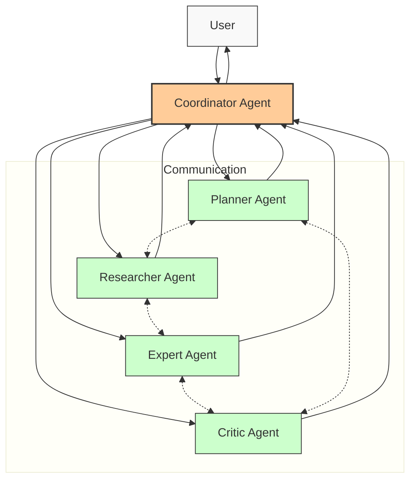

---
authors:
- muhammad
categories:
- LLMs
- Agents
comments: true
date: 2025-03-28
description: A deep dive into the architecture of LLM agents, their components, and practical applications.
tags:
- agents
- llm
- architecture
- rag
---

# A Visual Guide to LLM Agents

## Table of Contents
1. [Introduction to Large Language Models](#introduction-to-large-language-models)
2. [From LLMs to Agents](#from-llms-to-agents)
3. [Core Components of LLM Agents](#core-components-of-llm-agents)
4. [Tools and Augmentation](#tools-and-augmentation)
5. [Agent Planning and Reasoning](#agent-planning-and-reasoning)
6. [Agent Memory Systems](#agent-memory-systems)
7. [Advanced Agent Architectures](#advanced-agent-architectures)
8. [Multi-Agent Systems](#multi-agent-systems)
9. [Building and Deploying Agents](#building-and-deploying-agents)
10. [Future Directions](#future-directions)

## Introduction to Large Language Models

Before diving into agents, we need to understand what Large Language Models (LLMs) are and how they function.

LLMs are sophisticated neural networks trained on vast amounts of text data to understand and generate human-like text. These models have evolved from simple statistical approaches to complex architectures based primarily on the Transformer architecture introduced in 2017.

### How LLMs Work

At their core, LLMs predict the next token (word or subword) in a sequence based on the context provided. The basic architecture consists of:

- **Tokenization**: Converting input text into tokens
- **Embedding Layer**: Transforming tokens into vector representations
- **Transformer Layers**: Processing these vectors through attention mechanisms
- **Output Layer**: Generating probability distributions for the next token

Most modern LLMs use the transformer architecture, which employs self-attention mechanisms to weigh the importance of different words in context.

### Capabilities and Limitations of Traditional LLMs

**Capabilities:**
- Text generation across various domains
- Understanding context and nuance
- Adapting to different writing styles
- Performing various language tasks without task-specific training

**Limitations:**
- No ability to access or verify external information beyond training data
- No capability to take actions in the world
- Limited understanding of temporal context (when events occurred)
- No persistent memory between sessions
- No ability to use tools or APIs
- Risk of hallucinations (generating false information)

These limitations highlight why moving from passive LLMs to active agents is necessary for more complex applications.

## From LLMs to Agents

The transition from passive language models to active agents is fundamental to understanding LLM agents.

### What Defines an Agent?

As defined by Russell & Norvig, **"an agent is anything that can be viewed as perceiving its environment through sensors and acting upon that environment through actuators."**

This definition introduces two critical components missing in standard LLMs:
1. **Perception**: The ability to sense the environment
2. **Action**: The ability to affect the environment

### The Agent Framework

An agent-based framework adapts this definition to work with LLMs:

- **Environment**: The context in which the agent operates (could be a chat interface, document, or digital environment)
- **Perception**: Input methods like prompts, document content, or API responses
- **Reasoning**: Internal processing using the LLM to decide what to do
- **Action**: Outputs that affect the environment (generating text, calling functions, using tools)
- **Memory**: Retaining information across interactions

This framework transforms a passive text prediction system into an entity that can intelligently interact with its surroundings.

## Core Components of LLM Agents

Let's explore the essential components that make up an LLM agent:

### Environment Perception

Agents need to understand their environment through various inputs:

- **Text Input**: The most basic form of perception through prompts
- **Document Understanding**: Processing and understanding documents
- **Structured Data**: Working with databases, APIs, and structured information
- **Multimodal Input**: Processing images, audio, or other data types (in advanced agents)

### Planning and Reasoning

An agent must plan its actions and reason about the best course of action:

- **Task Decomposition**: Breaking complex tasks into manageable steps
- **Chain-of-Thought**: Working through problems step-by-step
- **Decision-Making**: Evaluating options and selecting the best course of action
- **Self-Reflection**: Evaluating its own reasoning and outputs

### Tool Usage and Integration

A defining characteristic of LLM agents is their ability to use tools:

- **Function Calling**: Identifying when to call an external function
- **API Integration**: Connecting to external services through APIs
- **Code Execution**: Running code to perform calculations or manipulate data
- **Database Access**: Retrieving or storing information in databases

### Memory Systems

Agents require memory to maintain context and learn from past interactions:

- **Short-Term Memory**: Recent conversation history
- **Long-Term Memory**: Persistent information stored across sessions
- **Episodic Memory**: Specific sequences of interactions
- **Semantic Memory**: General knowledge and facts

These core components transform an LLM into an agent capable of complex, goal-oriented behavior.

## Tools and Augmentation

Tools and augmentation techniques enhance the capabilities of LLM agents beyond their built-in knowledge.

### Types of Tools

Modern LLM agents can leverage various tools:

- **Search Tools**: Accessing up-to-date information from the internet
- **Calculators**: Performing precise mathematical operations
- **Knowledge Bases**: Accessing specific domain knowledge
- **Code Interpreters**: Executing and debugging code
- **Database Interfaces**: Querying and manipulating structured data
- **API Connectors**: Interacting with external services and platforms

### Retrieval Augmented Generation (RAG)

RAG is a powerful technique that combines retrieval of information with text generation:

1. **Indexing**: Documents are processed, chunked, and stored in a vector database
2. **Retrieval**: When a query is received, relevant documents are retrieved
3. **Augmentation**: Retrieved content is added to the prompt
4. **Generation**: The LLM generates a response based on both the query and the retrieved information

RAG enhances accuracy by grounding responses in specific knowledge sources, reducing hallucinations and improving factual accuracy.

### Function and API Integration

Function calling allows agents to interact with the world:

1. **Function Definition**: Functions are defined with names, descriptions, and parameter specifications
2. **Function Detection**: The LLM detects when a function should be called based on the user's query
3. **Parameter Generation**: The LLM generates the appropriate parameters
4. **Function Execution**: The function is executed, and results are returned
5. **Response Integration**: The LLM incorporates the function results into its response

This capability enables agents to perform actions like checking the weather, booking appointments, or processing payments.

## Agent Planning and Reasoning

Effective planning and reasoning are crucial for complex tasks.

### Prompt Engineering for Agents

Agent prompts typically include:

- **System Instructions**: Defining the agent's role and capabilities
- **Available Tools**: Descriptions of tools the agent can use
- **Constraints**: Limitations on the agent's actions
- **Output Format**: How the agent should structure its responses
- **Examples**: Demonstrations of expected behavior

### Chain-of-Thought (CoT) Reasoning

CoT enables an agent to work through problems step-by-step:

1. **Problem Analysis**: Understanding the task and breaking it down
2. **Intermediate Steps**: Working through each step logically
3. **Reflection**: Checking the reasoning at each step
4. **Solution**: Arriving at the final answer based on the steps

This approach significantly improves performance on complex reasoning tasks.

### ReAct Framework

ReAct (Reasoning + Acting) interleaves thinking and action:

1. **Reasoning**: The agent thinks about what it needs to do
2. **Action**: The agent takes action using available tools
3. **Observation**: The agent observes the results of its action
4. **Continued Reasoning**: The agent incorporates observations into its reasoning

This cycle continues until the task is complete, enabling dynamic, adaptive problem-solving.

## Agent Memory Systems

Memory systems enable agents to maintain context and learn from past interactions.

### Short-Term Context

Short-term or working memory includes:

- **Conversation History**: The recent exchanges between user and agent
- **Current Session Data**: Information gathered during the current interaction
- **Active Task State**: The current progress on the task being performed

These elements are typically handled through context window management.

### Long-Term Memory Storage

Long-term memory enables persistent information storage:

- **Vector Databases**: Storing semantic representations of past conversations
- **Knowledge Graphs**: Structured representations of entities and relationships
- **Document Stores**: Persistent storage of important information
- **User Profiles**: Preferences and patterns specific to individual users

### Episodic vs. Semantic Memory

Agents can implement different types of memory:

- **Episodic Memory**: Specific sequences of interactions (e.g., "Last time we discussed home renovation options")
- **Semantic Memory**: General knowledge and facts (e.g., "The user prefers minimalist design")

### Memory Retrieval Strategies

Effective retrieval is critical for using stored information:

- **Semantic Search**: Finding relevant information based on meaning
- **Temporal Filtering**: Retrieving information based on when it was stored
- **Relevance Ranking**: Prioritizing the most important information
- **Contextual Retrieval**: Finding information relevant to the current context

A well-designed memory system allows agents to build on past interactions and provide more personalized experiences.

## Advanced Agent Architectures

As agents become more sophisticated, their architectures evolve to handle more complex tasks.

### Task Decomposition

Complex task handling requires sophisticated decomposition:

1. **Goal Analysis**: Understanding the overall objective
2. **Subtask Identification**: Breaking down the goal into manageable parts
3. **Dependency Mapping**: Determining the order of subtasks
4. **Resource Allocation**: Assigning appropriate tools to each subtask

This approach enables agents to tackle problems too complex to solve all at once.

### Self-Reflection and Self-Correction

Advanced agents can evaluate and improve their own outputs:

1. **Output Generation**: Producing an initial response
2. **Self-Critique**: Identifying potential issues or improvements
3. **Refinement**: Revising the response based on self-critique
4. **Verification**: Checking the improved response against requirements

This recursive improvement process enhances accuracy and quality.

### Verification of Outputs

Ensuring reliability through verification:

- **Fact-Checking**: Verifying factual claims against reliable sources
- **Consistency Checks**: Ensuring internal consistency in responses
- **Hallucination Detection**: Identifying when the agent is generating unfounded information
- **Confidence Scoring**: Assessing the reliability of different parts of a response

### Meta-Prompting and Prompt Chaining

Sophisticated prompting techniques:

- **Meta-Prompting**: Using the LLM to generate or refine its own prompts
- **Prompt Chaining**: Connecting multiple prompts in sequence to handle complex workflows
- **Adaptive Prompting**: Modifying prompts based on user responses or task progress

These techniques allow for more flexible and powerful agent behaviors.

## Multi-Agent Systems

Multiple specialized agents can collaborate to solve complex problems.

### Agent Collaboration Models

Different models for agent collaboration:

- **Hierarchical**: Supervisor agents coordinate specialized worker agents
- **Peer-to-Peer**: Agents communicate directly with each other
- **Market-Based**: Agents bid for tasks based on their capabilities
- **Consensus-Based**: Agents work together to reach agreement on solutions

### Specialized Agent Roles

Multi-agent systems often feature specialized roles:

- **Planner**: Designs overall strategy and breaks down tasks
- **Researcher**: Gathers information from various sources
- **Expert**: Provides domain-specific knowledge and analysis
- **Critic**: Evaluates and improves outputs
- **Coordinator**: Manages communication between agents

### Communication Protocols

Effective inter-agent communication requires:

- **Message Formats**: Structured formats for exchanging information
- **Dialogue Management**: Tracking conversation state between agents
- **Knowledge Sharing**: Methods for sharing relevant information
- **Conflict Resolution**: Mechanisms for resolving disagreements

### Consensus Mechanisms

When agents must agree on a course of action:

- **Voting**: Simple majority or weighted voting schemes
- **Debate**: Agents present arguments and counter-arguments
- **Evidence Evaluation**: Assessing the quality of evidence presented
- **Meta-Evaluation**: Using another agent to evaluate competing proposals

Multi-agent systems enable more complex problem-solving than any single agent could achieve alone.

## Building and Deploying Agents

Practical considerations for implementing LLM agents.

### Frameworks and Libraries

Popular tools for building agents:

- **LangChain**: Framework for building language model applications
- **LlamaIndex**: Tools for connecting LLMs to external data
- **AutoGPT**: Autonomous AI agent framework
- **Microsoft Semantic Kernel**: Framework for integrating AI with traditional programming

### Evaluation Metrics

Assessing agent performance:

- **Task Completion Rate**: How often the agent successfully completes tasks
- **Efficiency**: Number of steps or time required to complete tasks
- **Accuracy**: Correctness of information and actions
- **User Satisfaction**: User ratings and feedback
- **Hallucination Rate**: Frequency of unfounded claims

### Safety Considerations

Important safety measures:

- **Action Limitations**: Restricting potentially harmful actions
- **User Confirmation**: Requiring approval for significant actions
- **Monitoring**: Tracking agent behavior for unexpected patterns
- **Transparency**: Making reasoning and sources clear to users

### Deployment Patterns

Common approaches to deployment:

- **Serverless Functions**: Deploying components as cloud functions
- **Containerization**: Packaging agents and dependencies in containers
- **API Services**: Exposing agent capabilities through APIs
- **Edge Deployment**: Running lightweight agents on edge devices

Careful attention to these aspects ensures agents that are effective, reliable, and safe.

## Future Directions

The field of LLM agents is rapidly evolving. Here are some emerging trends and challenges:

### Current Limitations

Areas needing improvement:

- **Reasoning Abilities**: Enhancing logical and causal reasoning
- **Tool Creation**: Enabling agents to create new tools as needed
- **True Autonomy**: Reducing the need for human oversight
- **Cross-Domain Knowledge**: Applying knowledge across different domains
- **Efficiency**: Reducing computational requirements

### Research Frontiers

Exciting areas of research:

- **Embodied Agents**: Connecting language models to robotic systems
- **Multi-Modal Agents**: Integrating text, vision, audio, and other modalities
- **Continual Learning**: Agents that learn and improve through interaction
- **Collective Intelligence**: Emergent capabilities from agent collaboration
- **Neural-Symbolic Approaches**: Combining neural networks with symbolic reasoning

### Potential Applications

Promising applications for advanced agents:

- **Personalized Education**: Tutors adapted to individual learning styles
- **Scientific Discovery**: Agents that generate and test hypotheses
- **Healthcare Assistance**: Diagnostic and treatment planning support
- **Creative Collaboration**: Partners for writing, design, and other creative tasks
- **Autonomous Systems**: Self-directed systems that adapt to changing conditions

### Ethical Considerations

Important ethical questions:

- **Transparency**: Ensuring users understand agent capabilities and limitations
- **Accountability**: Determining responsibility for agent actions
- **Privacy**: Protecting sensitive information used by agents
- **Bias**: Addressing biases in training data and reasoning
- **Human Augmentation**: Enhancing rather than replacing human capabilities

The future of LLM agents will depend on thoughtful approaches to these challenges and opportunities.

## Conclusion

LLM agents represent a significant evolution in artificial intelligence, transforming passive language models into active, capable assistants. By combining the language understanding of LLMs with the ability to perceive, reason, and act, these agents can solve increasingly complex problems and provide more valuable assistance.

As the technology continues to develop, we can expect agents to become more autonomous, capable, and integrated into our daily lives and work. The journey from simple language models to sophisticated agents is just beginning, with many exciting possibilities on the horizon.

The most successful approaches will likely be those that thoughtfully combine the strengths of artificial and human intelligence, creating systems that augment human capabilities rather than simply attempting to replace them.