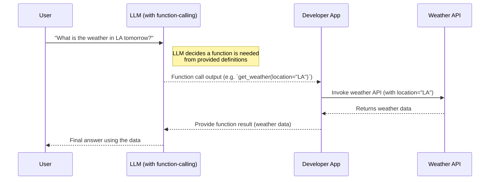
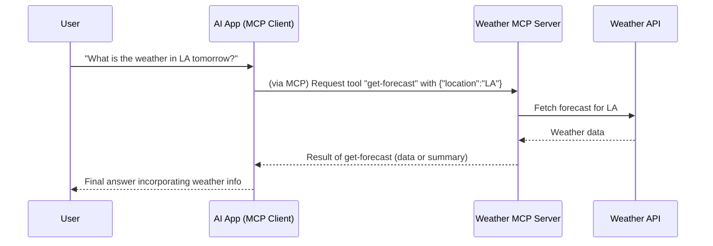
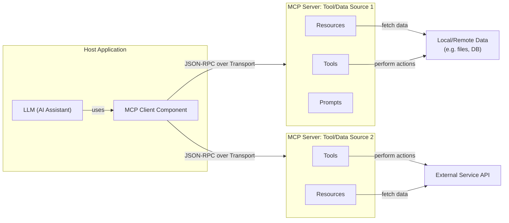
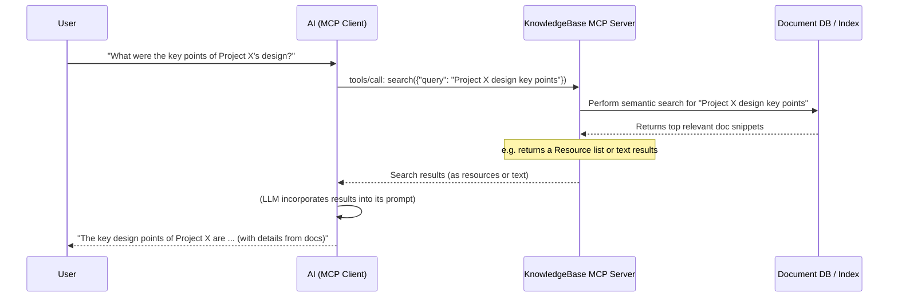

---
authors:
- muhammad
categories:
- LLMs
- Agents
comments: false
date: 2025-03-31
description: Model Context Protocol (MCP) - A Quick Intro
tags:
- agents
- llm
- architecture
- mcp
---

# Introduction
## What is MCP?
The Model Context Protocol (MCP) is an open, standardized protocol introduced by Anthropic that bridges AI models with external data sources, tools, and services. Think of MCP like a "USB-C for AI applications" – it provides a universal adapter for connecting AI assistants to various content repositories, business tools, code environments, and APIs. By defining a common interface (built on JSON-RPC 2.0) for communication, MCP enables large language models (LLMs) to invoke functions, retrieve data, or use predefined prompts from external systems in a consistent and secure way.

## Purpose and Problem Addressed
MCP was designed to solve a major integration challenge often called the "M×N problem" in AI development. Traditionally, integrating M different LLMs with N different tools or data sources required custom connectors for each combination – a combinatorial explosion of ad-hoc code. This meant AI systems were largely isolated from live data, trapped behind information silos unless developers painstakingly wired in each external API or database. MCP addresses this by providing one standardized "language" for all interactions.

In practice, developers can create one MCP-compliant interface for a data source or tool, and any MCP-enabled AI application can connect to it. This open standard thus replaces fragmented one-off integrations with a sustainable ecosystem of compatible clients and servers. The result is a simpler, more scalable way to give AI assistants access to the fresh, relevant context they need – whether it's company documents, live databases, or web results.

Importantly, MCP is two-way and secure: it enables LLMs to query data and perform actions, while allowing organizations to keep data access controlled (the latest spec even supports OAuth 2.1 for authentication).

In summary, MCP's purpose is to make AI integrations interoperable, secure, and context-rich, turning isolated LLMs into truly context-aware systems.

# Comparison: Model Context Protocol (MCP) vs. Simpler Function-Calling APIs

MCP represents a more comprehensive and standardized approach to AI-tool integration compared to the simpler function-calling mechanisms provided by vendors like OpenAI or Google. Below we contrast MCP with typical LLM function-calling or plugin approaches:

## Scope of Integration
Traditional function calling (e.g. OpenAI's function call API) lets a developer define a few functions that an LLM can call during a single chat session. While useful, this is relatively limited in scope – each function integration is custom and tied to one specific model or platform. In contrast, MCP covers a broader scope: it standardizes not just function calls, but also data retrieval (resources) and reusable prompt workflows across any number of tools. An MCP server can expose multiple capabilities (data, tools, prompts) at once to any compatible AI client. This turns the one-off "tool use" into a universal interface for many integrations at scale.

For example, via MCP a single AI assistant could simultaneously connect to a code repository, a database, and a web browser tool – all through one protocol – whereas vanilla function calling would require baking in each integration separately.

## Standardization and Interoperability
OpenAI's function calls and ChatGPT plugins are proprietary approaches – they work primarily within OpenAI's ecosystem (or Google's, for their functions) and follow vendor-specific formats. Each ChatGPT plugin essentially required its own mini-integration defined by an OpenAPI spec, and only certain platforms (like ChatGPT or Bing) could use those plugins.

By contrast, MCP is an open standard from the ground up. It's vendor-agnostic and designed for broad adoption: any LLM provider or tool builder can implement MCP's JSON-RPC interface. Think of ChatGPT plugins as specialized tools in a closed toolbox, whereas MCP is an open toolkit that any AI platform or developer can utilize. This standardization means an MCP-compliant server (say for Google Drive, Slack, etc.) can be used by Anthropic's Claude, OpenAI's ChatGPT (which recently announced support), or a local open-source LLM alike. MCP's interoperability has gained momentum – even OpenAI and Microsoft have added support for it, signaling industry convergence on open standards.

## State Management and Persistence
Simple function-calling is typically stateless beyond the immediate request. The LLM calls a function and gets a result, but there is no persistent connection – each tool use is a one-shot call embedded in the prompt/response cycle. MCP, on the other hand, establishes a persistent client–server connection. An MCP server can maintain state across multiple calls (e.g. keep a database connection open, remember prior queries, cache results, etc.). This opens the door to more complex, multi-turn interactions with tools.

For instance, an MCP server could handle a session with an AI agent, allowing the agent to iteratively query data, refine results, or perform a sequence of actions with continuity. The client-server architecture means there's an ongoing "conversation" between the AI (client) and the tool backend (server), rather than just isolated function calls. Additionally, MCP's model of Resources (described later) allows large data to be loaded or referenced as needed, instead of stuffing everything into a single prompt window. In short, MCP is built for long-lived, context-rich interactions with external systems, unlike the transient function calls of simpler APIs.

## Safety and Permissions
With basic function calling, developers must implement any approval or safety checks themselves in the loop. MCP formalizes some of this. By design, MCP assumes a human or host application is in the loop for potentially risky actions – for example, tools calls are intended to be approved by a user, and the protocol supports permissioning and authentication at a systemic level. The updated MCP spec even includes standardized OAuth 2.1 flows for granting access to protected resources. This level of built-in security and consent is beyond what the raw function-call interfaces provide, making MCP better suited for enterprise and sensitive integrations.

## Multi-Model Flexibility
Because MCP decouples tools from any specific model, it gives developers flexibility to switch LLM providers or models without redoing integrations. For example, an application could use Anthropic's Claude today and swap to another MCP-compatible model tomorrow, and all the same MCP servers (tools) would still work. In contrast, OpenAI's function calling is tightly coupled to using OpenAI's models; there's no guarantee those function definitions would port to Google's PaLM or others. MCP's standardized interface acts as a neutral layer between models and tools.

# Interaction Flow: Traditional Function Call vs. MCP

To illustrate the difference, let's compare the flow of an AI using an external weather API via traditional function-calling versus using MCP:

## Function-Calling Workflow (e.g. OpenAI API)



In the above function-calling flow, the developer had to predefine a get_weather function in the prompt and intercept the model's output to call the API. The interaction with the external service (Weather API) is not standardized – it's custom code in the developer's app, and the connection is not persistent (just a single call). The LLM itself doesn't maintain a direct connection to tools; it relies on the developer to mediate every call.

## MCP Workflow (Client–Server with Weather Tool)



In the MCP flow, the AI application (client) has an established connection to a Weather MCP server that exposes a get-forecast tool. The LLM (e.g. Claude or ChatGPT with MCP support) can directly trigger that tool via the MCP client, without the developer writing custom code for this API call. The MCP server handles communicating with the Weather API and returns the result in a standardized format. The AI model receives the weather info through MCP and can respond to the user.

Notably, this happens through a consistent protocol – any other MCP-compatible weather service would work the same way. Also, the connection can be two-way: if the Weather server had multiple actions or needed additional queries, the conversation over MCP could continue beyond a one-shot call. This demonstrates how MCP generalizes and extends the idea of function calling into a full client–server integration pattern.

# Core Components of MCP

MCP defines a set of core components (primitives) that structure how clients and servers interact and what they can do. There are three server-side primitives (which servers provide) and two client-side primitives (which clients provide). Understanding these components is key to using MCP effectively:

## Server-Side Primitives
These are capabilities that an MCP Server exposes to add context or functionality for the LLM. An MCP server can implement any or all of these:

### Resources
Resources are pieces of data or content that the server makes available for the AI to read and include in its context. A resource might be a file's contents, a database record, an email, an image, etc. – anything that could be useful as additional information for the model. Each resource is identified by a URI (like file://docs/report.pdf or db://customers/123) and can be fetched via the protocol.

Importantly, resources are typically read-only context: the AI doesn't execute them, it uses them as reference material. For example, a "Docs Server" might expose a document's text as a resource so the AI can quote or summarize it. Resources are usually application-controlled, meaning the client or user decides which resources to pull in (to avoid flooding the model with irrelevant data). In practice, an AI interface might let a user pick a file (resource) to share with the assistant. If truly on-demand model-driven access is needed instead, that's where tools come in. Resources help inject structured data into the LLM's prompt context in a standardized way.

### Tools
Tools are executable functions that the server can perform on request. These are analogous to the "functions" in function-calling, but defined in a standard JSON schema format and invoked via MCP endpoints. Tools allow the AI to perform actions or fetch calculated information – for example, run a database query, call an external API, execute a computation, or even control a web browser.

Each tool has a name, a description, and a JSON schema for its input parameters. The server lists available tools, and the AI (through the client) can call them by name with the required args. Tools are model-controlled with a human in the loop. This means the design assumes the AI can decide when to use a tool (e.g. the LLM's reasoning says "I should use the database_query tool now"), but the user or client must approve the action for safety.

When invoked, the server executes the underlying function and returns the result (or error) to the client. Tools can be simple (e.g. a calculator) or very powerful (e.g. a tool that can send an email or modify data). Unlike resources, tools can have side effects or dynamic outputs – they may change external state or retrieve live data. This makes them essential for building AI agents that act, not just observe.

### Prompts
Prompts in MCP are reusable prompt templates or workflows that servers provide. A Prompt primitive is essentially a predefined way to interact with the model, which could involve multiple steps or a structured input. Servers define prompts to standardize common interactions – for example, a prompt template to "Summarize document X in style Y", or a multi-turn workflow to "Debug an error by asking these follow-up questions".

Each prompt is identified by a name and can accept input arguments (e.g. the document to summarize, the style to use). The client can query the server for available prompts, which might be presented to the user (for instance, an IDE could show a list of MCP prompt actions like "Explain this code" powered by the server). When a prompt is selected, the server can then guide the interaction: it might inject certain instructions to the model, include relevant resources automatically, or even orchestrate a chain of LLM calls.

Prompts are typically user-controlled, meaning the user explicitly triggers those workflows (like choosing a predefined query or action). Under the hood, a prompt might use the other primitives – e.g. it could fetch some resource or call a tool as part of its process – to produce the final result. Prompts let developers encapsulate complex behaviors or multi-step conversations behind a single command, making them easy to reuse.

In summary, on the server side: Resources = data context, Tools = actions/functions, and Prompts = preset conversational patterns. These primitives "speak" JSON-RPC – e.g. there are standard methods like resources/list, resources/read, tools/list, tools/call, prompts/list, etc., which the client can call to discover and use these primitives. By separating them, MCP makes clear what the AI is intending to do – whether it's just reading data, executing a function, or following a guided script, each has a defined protocol.

## Client-Side Primitives
These are features that an MCP Client (host application) provides, which servers can leverage. There are two main client-side primitives:

### Roots
A Root is essentially a boundary or entry point that the client suggests to the server for where to focus. When an MCP connection starts, the client can send one or more "root URIs" to the server. This informs the server about the relevant workspace or scope.

For instance, if a developer is working in /home/user/myproject/, the client might set that as a root for a Filesystem server – indicating the server should consider that directory as the project context (and not roam outside it). Or a root could be a specific URL or database name that the server should use as the primary endpoint. Roots thus provide guidance and organization, especially when multiple data sources are in use.

They do not hard-enforce access limitations (the server could technically go beyond, unless the server itself restricts it), but they serve as a contract of what the current context is. This helps keep interactions focused and secure – the server knows what subset of data it should operate on, and the client knows the server won't unexpectedly access unrelated data. Not all scenarios require roots, but they are very useful in development tools (for setting project scope) and similar contexts.

### Sampling
Sampling is a powerful client-side feature that allows the server to ask the client's LLM to generate a completion. In simpler terms, it lets the server turn around and say: "I need the AI to complete/answer this sub-task for me." This might sound unusual, but it enables advanced workflows like agents that can reason recursively.

For example, imagine a complex tool that, in the middle of its function, realizes it needs an LLM's help to parse something or make a decision – the server can send a sampling request to the client, providing a prompt, and the client will invoke the LLM to get a result, then return it to the server. The server can then proceed using that result. All of this happens under the hood of the protocol, with the crucial caveat that the user (or host application) should approve any such additional LLM call.

The design is meant for "agents calling themselves," but with human oversight to avoid infinite loops or undesired actions. Sampling requests include a formatted message (or conversation) that the server wants the model to continue, and possibly preferences for which model or how to balance speed vs. accuracy.

This feature essentially lets the server compose intelligence: an MCP server could chain multiple LLM calls or do intermediate reasoning by leveraging the client's model. It's an advanced capability (not all clients support it yet, and it should be used judiciously), but it opens the door to sophisticated agent behaviors. With Sampling, MCP isn't just one LLM interacting with tools – it could be tools temporarily invoking the LLM in return, enabling nested AI reasoning.

These five components – Resources, Tools, Prompts, Roots, and Sampling – form the core of MCP's design. The protocol is essentially a set of JSON-RPC methods that implement these primitives in a standardized way. By mixing and matching them, one can achieve various integration patterns. For example, a given MCP server might only implement Tools (if it purely offers actions like a Calculator server), or implement Resources + Prompts (if it mainly offers data and some templated queries on that data), etc. Clients similarly may or may not support Sampling or Roots depending on the application. The upshot is that MCP gives a common structure to describe "what an AI can do" in a given context: read this data, use these tools, follow these templates.

# Architecture: Client–Server Design

At a high level, MCP follows a classic client–server architecture tailored to AI needs. The design involves a Host application that incorporates an MCP client, which connects to one or more external MCP servers. Let's break down the pieces:

## MCP Host and Client
The host is the main AI application or agent environment. For example, Claude Desktop (Anthropic's chat app) is an MCP host, as are certain IDE extensions, chat UIs, or agent orchestration frameworks. The host contains the MCP client component, which is responsible for managing the connection to servers and mediating between the LLM and those servers.

The client knows how to speak MCP (it implements the protocol on the client side: sending requests like tools/call to servers, and handling incoming requests like sampling/createMessage from servers). It maintains a 1:1 connection with each server it uses. In practice, a host might spawn multiple client connections if it's using multiple servers at once (for example, connect to a GitHub server and a Slack server concurrently).

The LLM itself (the model) is usually integrated into the host – for instance, Claude (the model) running locally or via API is what generates the responses, and the MCP client is feeding it information and tool results.

## MCP Server
An MCP server is a lightweight program or process that exposes a specific set of capabilities (the primitives we discussed) via the MCP protocol. Each server typically corresponds to a particular domain or service. For example, one server might interface with a file system (exposing files as resources, and perhaps a prompt for searching files), another might interface with Google Drive, another with GitHub, a database, or a web browser, etc.

The server runs separately from the AI model – it could be on the same machine or a remote one – and communicates with the client over a communication channel. Servers declare what capabilities they have during initialization (for instance, "I support resources and tools, but not prompts") so the client knows how to interact.

Importantly, servers are stateless with respect to the protocol (they handle requests as they come) but can maintain internal state or connections (e.g. keep a DB session). They do not directly talk to the LLM; instead, all interaction is through the structured protocol messages.

## Communication (Transports & JSON-RPC)
MCP's communication is built on JSON-RPC 2.0 as the message format. This means every action (like listing tools or calling a resource) is a JSON request with a method name and params, and responses are JSON objects with results or errors. The protocol supports both requests (with responses) and notifications (one-way messages) in both directions – so the server can call methods on the client (like sampling/createMessage) and the client can call methods on the server (like tools/call).

The underlying transport layer can vary. Two common transport modes are:

**Stdio (Standard I/O)**: Ideal for local setups, the client can launch the server as a subprocess and communicate via its stdin/stdout streams. This is simple and secure for local integrations – e.g. Claude Desktop can run an MCP server on your machine via stdio.

**HTTP (with SSE or WebSocket)**: For remote servers, MCP can run over HTTP. Initially, the spec used HTTP + Server-Sent Events (SSE) for server-to-client streaming, but an updated streamable HTTP transport was introduced (Mar 2025) to allow full bidirectional streaming over a single connection. In either case, the client might make HTTP POST requests for each JSON-RPC call and keep a channel open for streaming responses. WebSocket is another possible transport for continuous two-way communication.

The transport is abstracted in MCP – developers don't usually worry about it beyond choosing one that fits their deployment. The key is that client and server establish a connection and exchange JSON-RPC messages. The first messages in a session are an initial handshake: the client sends an initialize request (with its MCP version and what features it supports, e.g. "I support roots and sampling") and the server responds with its own capabilities and version. Once initialization is done, they exchange an initialized notification and then the session is ready for general use.

Either side can then send requests or notifications according to the protocol. For example, right after init, the client might call prompts/list or tools/list to discover what the server offers. From then on, the LLM (through the client) can start using those tools/resources.

## Lifecycle
The MCP connection stays alive as long as needed. If the user closes the host app or a certain task is done, the client can send a shutdown message or simply disconnect the transport, ending the session. Servers and clients are expected to handle disconnects or errors gracefully (MCP defines standard error codes for invalid requests, internal errors, etc., similar to JSON-RPC's spec).

Below is a diagram of the core MCP architecture with its main components and data flow:



In this diagram, the Host application (which contains the AI model and the MCP client library) maintains connections to two MCP servers. Server1 might be a local server (e.g. providing file system access – hence its tools/resources tie into local files or a database), and Server2 might be a remote service integration (e.g. a weather API server, which calls an external web service). The MCP client handles the JSON-RPC messaging to each server.

When the LLM needs something, it formulates a request that the client sends to the appropriate server; when a server needs something (like performing a sampling request or notifying of new data), it sends that to the client. The primitives (Tools, Resources, Prompts) inside each server define what it can do.

For example, if the user asks the AI "Summarize the latest sales data", the AI client might use a Prompts primitive from Server1 that knows how to retrieve sales records (as Resources) and then guide the model to summarize them. Meanwhile, if the user asks "Also, what's the weather in LA?", the AI client can call a Tool on Server2 to get that info. All of this happens through the uniform MCP interface.

As the ecosystem grows, we might have dozens of servers (for Git, Jira, Gmail, etc.), but crucially, an AI app doesn't need to have custom code for each – it just speaks MCP to whichever servers are available.

## Standardization
Because both client and server follow the MCP spec, any compatible client can talk to any server. This fosters an ecosystem where companies and the community are building a "library" of MCP servers for many common tools. Anthropic has open-sourced reference servers for Google Drive, Slack, Git, GitHub, Postgres, web browser automation, and more. Community contributors have added many others (at the time of writing, hundreds of MCP connectors exist for various services).

On the client side, multiple products have added MCP support (Claude's apps, developer IDE plugins, agent frameworks like LangChain, etc.). This architecture and standardization are what turn MCP into that "universal port" for AI – it decouples the integration logic (server side) from the AI agent logic (client side), with a well-defined protocol in between.

# Python Tutorial: Building and Using MCP (Step-by-Step)

Now that we've covered concepts, let's get hands-on with a Python tutorial using MCP. We'll walk through creating a simple MCP server and demonstrate a client interacting with it. For this tutorial, we'll use the official MCP Python SDK (open-sourced by Anthropic) for convenience. (The SDK abstracts a lot of JSON-RPC boilerplate and lets us focus on defining our tools/resources). If you haven't already, you can install the SDK via pip:

```bash
pip install mcp
```

(The package name is mcp. This includes the server framework and some CLI tools.) Let's proceed in steps:

## 1. Setting Up a Basic MCP Server

First, we'll create a minimal MCP server script in Python. This server will expose a trivial functionality just to verify everything works. We'll use the SDK's FastMCP class to create a server instance and run it.

```python
# server.py
from mcp.server.fastmcp import FastMCP

# Initialize an MCP server with a name
mcp = FastMCP("Demo Server")

# Start the server (using stdio transport by default).
# This call will block and wait for a client connection.
mcp.serve()
```

In this snippet, we import FastMCP and instantiate it with a name "Demo Server". The FastMCP class is a high-level server that handles MCP protocol compliance and transport setup for us. By calling mcp.serve(), we tell it to begin listening for an MCP client. By default this uses the standard I/O transport (suitable if this script is launched by a host app). At this point, our server doesn't actually expose any tools or resources yet – it's an empty shell. But it can respond to basic protocol requests like initialize and will report that it has no capabilities.

## 2. Exposing a Tool (Function) on the Server

Now we'll add a simple Tool to our server. The SDK provides a convenient decorator @mcp.tool to turn a Python function into an MCP tool. For demonstration, we'll add a basic arithmetic tool and then run the server.

```python
from mcp.server.fastmcp import FastMCP

mcp = FastMCP("Demo Server")

# Define a tool using a decorator. This tool adds two numbers.
@mcp.tool()
def add(a: int, b: int) -> int:
    """Add two numbers and return the result."""
    return a + b

mcp.serve()
```

With the @mcp.tool() decorator, the SDK automatically registers our add function as a Tool primitive. Under the hood, it will assign it a name (defaulting to the function name "add" here) and generate a JSON schema for the input parameters a and b (both integers, in this case). It also captures the docstring as the tool's description, which is useful for the AI to understand what it does.

When this server is running, an MCP client that connects can call tools/list and will see something like:

```json
{
  "tools": [
    {
      "name": "add",
      "description": "Add two numbers and return the result.",
      "inputSchema": {
        "type": "object",
        "properties": {
          "a": {"type": "integer"},
          "b": {"type": "integer"}
        }
      }
    }
  ]
}
```

This is how the client discovers what functions are available. The inputSchema is derived from our function signature (using type hints, or it would default to accepting arbitrary JSON structure if not annotated). Now the add tool can be invoked via the MCP method tools/call with appropriate parameters.

Let's test our server's tool quickly (in a real scenario, we'd connect an actual client, but here we'll simulate what a client would do for illustration). We can write a tiny MCP client snippet or use the SDK's CLI. For simplicity, imagine the client calls:

```python
# Pseudo-client code (for illustration only)
from mcp import Client  # assume the SDK has a Client class for connecting

client = Client.connect_stdio("./server.py")   # Launch server.py and connect via stdio
tools = client.list_tools()                    # should list the "add" tool
result = client.call_tool("add", {"a": 3, "b": 4})
print(result)  # expected output: 7
client.disconnect()
```

In reality, one might use the mcp CLI tool: for example, running mcp dev server.py will start the server and open an interactive interface (MCP Inspector) where you can manually invoke tools and see the results. Or, if using Claude Desktop, one could configure it to run this server and then simply ask Claude, "What's 3+4?" – the model could decide to use the add tool and would get the answer 7 from the server.

The key takeaway is that adding a tool is as simple as defining a Python function with the SDK; MCP takes care of exposing it in a standardized way.

## 3. Exposing a Resource (Data) on the Server

Let's extend our server to also provide a Resource. We'll make a resource that gives a friendly greeting. This will demonstrate how resources can supply text for the model's context. We use the @mcp.resource("uri_pattern") decorator to register a resource handler.

```python
from mcp.server.fastmcp import FastMCP

mcp = FastMCP("Demo Server")

@mcp.tool()
def add(a: int, b: int) -> int:
    """Add two numbers and return the result."""
    return a + b

# Define a resource. The URI pattern {name} means the client can request e.g. "greet://Alice"
@mcp.resource("greet://{name}")
def get_greeting(name: str) -> str:
    """Resource content: returns a greeting for the given name."""
    return f"Hello, {name}! Welcome to MCP."

mcp.serve()
```

Here we used @mcp.resource("greet://{name}"). This tells the server that it can handle any resource URI of the form greet://<something> – the <something> will be passed as the name argument to our function get_greeting. So if the client later requests the resource greet://Alice, our function returns "Hello, Alice! Welcome to MCP.". The server will transmit that string as the content of the resource. We provided a description in the docstring as well.

The client's perspective: if it calls resources/list, it might not list all possible greetings (since {name} is a parameterized resource), but some servers do list resource "directories" or examples. In any case, the client can directly do a resources/read on a specific URI. For example, an AI client could be prompted (via system message) that greet://{name} resources are available for use. If the user asks "Can you greet Alice?", the AI could fetch greet://Alice from the server (the client would call resources/read with uri: "greet://Alice"). The server invokes get_greeting("Alice") and returns the text. The LLM then sees that text and can respond to the user with it.

Resources are a nice way to serve static or computed data that the model might include in its answer verbatim. They behave somewhat like HTTP GET endpoints (in REST analogy).

Now our Demo Server has both a Tool (add) and a Resource (greet://{name}).

## 4. Adding a Prompt (Reusable Template)

For completeness, let's add a Prompt to our server. Suppose we want a standardized way for the AI to request a calculation and explanation. We'll create a prompt that, given a math problem, instructs the model to solve it step-by-step.

```python
from mcp.server.fastmcp import FastMCP
from mcp.server.fastmcp.prompts import base  # utility for prompt message objects

mcp = FastMCP("Demo Server")

@mcp.tool()
def add(a: int, b: int) -> int:
    """Add two numbers and return the result."""
    return a + b

@mcp.resource("greet://{name}")
def get_greeting(name: str) -> str:
    """Resource content: returns a greeting for the given name."""
    return f"Hello, {name}! Welcome to MCP."

@mcp.prompt()
def solve_math(problem: str) -> list[base.Message]:
    """Prompt: guides the model to solve a math problem."""
    # This returns a conversation (list of messages) as a template
    return [
        base.SystemMessage("You are a helpful math assistant."),
        base.UserMessage(f"Please solve the following problem: {problem}"),
        base.AssistantMessage("Sure, let me break it down..."),
    ]

mcp.serve()
```

We used @mcp.prompt() to define solve_math. In this case, our function returns a list of message objects (using the SDK's base.SystemMessage, base.UserMessage, etc., which likely correspond to the roles in a chat prompt). This defines a prompt template where the assistant is primed with a system role and an initial user request, and even an initial assistant response to indicate it will explain step-by-step. The specifics aren't too important – the idea is that the server can package this multi-turn template and offer it as a named prompt.

The client will see this if it calls prompts/list:

```json
{
  "prompts": [
    {
      "name": "solve_math",
      "description": "Prompt: guides the model to solve a math problem.",
      "arguments": [
        {
          "name": "problem",
          "description": "",
          "required": true
        }
      ]
    }
  ]
}
```

The client (or user) can then invoke this prompt. For instance, a UI might show an option "Solve a math problem" which triggers prompts/execute (or a similar method) on the server with name: "solve_math" and problem: "2+2*5" as an argument. The server would return the prepared messages; the client would feed those to the LLM, and the LLM would continue the conversation from that context (producing a detailed solution). Essentially, the prompt primitive allows packaging expert instructions or workflows so the model can perform them on demand.

We now have a server that demonstrates all three server-side primitives:
- A Tool (add)
- A Resource (greet://{name})
- A Prompt (solve_math)

## 5. Running the Server and Client Interaction

To test our MCP server, we need an MCP client. In real-world usage, the "client" might be a GUI application (Claude Desktop) or an agent loop. Here, we can simulate a simple client or use the CLI. For brevity, let's illustrate using the CLI approach to interact with our server:

```bash
# In one terminal, run the server (it will wait for client connection)
python server.py
```

Now, in another terminal, we can use the mcp CLI (installed with the SDK) to connect:

```bash
mcp dev server.py
```

This should connect to the running server (or launch it if not already) and drop us into an interactive MCP Inspector. We could then try:
- Listing tools: this should show the add tool.
- Calling a tool: e.g. call add with {"a":5,"b":7} and expect result 12.
- Reading a resource: e.g. request resource URI greet://Alice and see the text.
- Executing a prompt: e.g. run prompt solve_math with argument "12*3-4" and watch the assistant's step-by-step solution.

If all goes well, the server will log or display calls as it handles them. The SDK likely prints logs for each request. You'd see that our Python functions are triggered accordingly.

For a programmatic approach, one could also use the Python SDK's client classes to do the same. For example:

```python
# Using Python to connect via stdio (hypothetical example)
from mcp.client import StdioClientTransport, Client

# Start the server process and connect transport (pseudo-code)
transport = StdioClientTransport("./server.py")  # launch our server script
client = Client(transport)

# Initialize the MCP connection
client.initialize()  # sends initialize handshake

# List and call the 'add' tool
tools = client.request("tools/list", {})
print(tools)  # should include 'add'
result = client.request("tools/call", {"tool": "add", "params": {"a": 2, "b": 3}})
print(result)  # should output {'result': 5}

client.close()
```

The actual API may differ, but the concept is that the client sends JSON-RPC requests like {"method": "tools/call", "params": {"tool": "add", "params": {"a":2,"b":3}}} and receives a response {"result": 5}. The SDK's Client class would wrap this in a nicer interface.

Through this step-by-step exercise, we saw how to implement an MCP server in Python with minimal effort (just defining functions with decorators) and how a client might interact. In a real deployment, you might build much more complex servers – connecting to real databases, handling authentication, streaming large resources, etc. – but the pattern remains the same. Anthropic's SDK and spec provides a lot of guidance and examples for building robust servers (including lifecycle management, dependency injection, error handling, etc., as shown in their docs).

# Advanced Use Cases and Workflows

With the fundamentals in place, let's discuss some advanced use cases of MCP and how it fits into larger AI systems:

## Handling Complex State and Workflows

One powerful aspect of MCP's design is that a server can maintain and manage complex state over the course of a session. For example, consider an MCP server that interfaces with a user's email. Such a server might need to handle authentication, caching of email headers, incremental fetching of emails, etc.

Using MCP, the server could manage an OAuth login flow (especially with the new OAuth 2.1 support in the protocol for secure client-server auth), store the user's token, and reuse it for subsequent requests – all internally. The AI client just calls high-level tools like list_emails or send_email, and the server handles the gritty details with its state.

Another scenario is maintaining conversational or task state. Suppose you have an agent working on a coding task using multiple tools: a Git server, a documentation server, etc. The agent might ask the Git server to open a file (as a resource), edit it (via a tool), then ask for a diff. The Git MCP server could keep track of an open repo and the last opened file across those calls, rather than requiring the AI to specify everything each time.

This is facilitated by MCP's session – since the connection is persistent, the server can hold onto objects in memory (like a database connection or a file handle) between calls. In our earlier Python example, the SDK even showed a concept of a lifespan context where you can initialize resources at server startup (e.g. connect to a DB) and clean up on shutdown. That means complex state (like a database pool or an in-memory cache) can be established once and reused, improving efficiency and making the server more capable.

Chaining and Multi-step workflows: Using prompts and sampling, servers can also coordinate multi-step processes. For instance, a single MCP prompt might involve the server first fetching some data (resource), then formulating a series of messages (prompt template), possibly even calling an internal model (sampling) to pre-analyze something, and finally returning a polished prompt for the client's LLM to answer. This is a form of agent orchestration that can be hidden behind a single MCP call. Essentially, the server can implement a mini-agent or state machine, but expose it as a simple interface to the client. The separation of concerns here is neat: the server handles procedure and state, the client's LLM handles language generation.

## Integration with Agent Frameworks

MCP is quickly being adopted by AI agent frameworks and libraries, which is a testament to its flexibility. One notable integration is with LangChain, a popular framework for chaining LLM calls and tools. The LangChain team and community have built adapters to use MCP servers as LangChain tools.

For example, rather than writing a custom tool wrapper for every API in LangChain, you can now spin up an MCP server (or use an existing one) and then use a converter that turns all of that server's Tools into LangChain Tool objects. This means LangChain-powered agents can immediately gain access to the huge library of MCP connectors (there are MCP servers for many services).

Conversely, tools defined within LangChain could potentially be exposed via an MCP server to other systems. Beyond LangChain, other agent frameworks and IDE assistants are on board. The "fast-agent" project, for instance, is an MCP client that supports all features including Sampling and can coordinate multi-modal inputs.

Developer tools like Cursor editor and Continue (VS Code extension) have added MCP support so that code assistants can use external tools uniformly. Even Microsoft's Guidance / Autogen frameworks and OpenAI's new Agents SDK are aligning with these standards.

The fact that OpenAI itself announced MCP support in its Agents SDK shows that even proprietary agent ecosystems see value in interoperability. What does this mean for a developer? If you're building an AI agent, you could use MCP as the backbone for tool usage. Instead of hardcoding how to call each API, you let the agent discover available MCP servers and use them. The agent can remain focused on planning and high-level reasoning, delegating actual tool execution to MCP servers.

This leads to more modular agent design – you can mix and match capabilities by just running different servers. Want to add calendar access to your agent? Just run a Calendar MCP server and connect it; no need to retrain the model or rewrite logic, because the model will see the new "calendar tool" via MCP and can start using it (assuming it's been instructed appropriately). This plug-and-play nature fits nicely with the vision of agents that can expand their toolsets dynamically.

## Retrieval-Augmented Generation (RAG) with MCP

Retrieval-Augmented Generation refers to the workflow where an LLM fetches relevant external information (from a document corpus or knowledge base) to augment its responses. MCP is an excellent vehicle for implementing RAG in a standardized way. Instead of custom retrieval code, one can create an MCP server that encapsulates the retrieval logic.

For example, imagine you have a vector database of documents or an ElasticSearch index. You could build an MCP server KnowledgeBaseServer with a tool search(query: str) -> list[str] (or which returns resource URIs). The AI model, when asked a question, can call this search tool via MCP to get relevant text snippets (as either direct text results or as resource references that it then reads). Those snippets then become part of the context for answering the question. Because MCP can handle streaming and large data via resources, even bigger documents can be fetched in chunks as needed.

The advantage is consistency and reuse: any MCP-aware AI app could use that same server for retrieval. In fact, Anthropic's documentation includes a quickstart where Claude uses an MCP server to fetch weather info – which is essentially a form of retrieval (getting factual data) before answering. The pattern extends to any knowledge domain.

Let's sketch an advanced RAG flow with MCP in a sequence diagram for clarity:



In this RAG scenario, the heavy lifting of retrieval is done by the KB_Server. The AI client just knows that when it needs info, it can call the search tool. This decoupling means you could swap out the implementation (maybe use a different database or algorithm) by switching the server, without changing the AI's approach. Moreover, because MCP is model-agnostic, even if you used a different LLM tomorrow, it could perform the same retrieval process by using the server.

MCP also helps maintain conversation flow in RAG. Traditional retrieval might not keep state of what's already fetched, but an MCP server could track which documents have been shown to the model (to avoid repetition or to follow up with more details as needed). It could also expose each document as a Resource with a URI, so that the model can say "let me read resource doc://123" in parts. All of this can be done with a clear protocol, rather than custom ad-hoc methods.

### RAG Implementation Strategies with MCP

There are several approaches to implementing RAG with MCP, each with its own advantages:

#### 1. Tool-based Retrieval
The simplest approach is to expose a search tool that returns relevant content directly. The model asks a question, calls the search tool with appropriate keywords, and gets back content in the tool response:

```python
@mcp.tool()
def search_knowledge_base(query: str, max_results: int = 3) -> list[dict]:
    """Search the knowledge base for documents matching the query."""
    # Search logic using vector DB, keyword search, etc.
    # Each result has the document content and metadata
    return [
        {"content": "...", "source": "doc1.pdf", "relevance": 0.92},
        {"content": "...", "source": "doc2.pdf", "relevance": 0.87},
        # ...
    ]
```

This approach is straightforward but may have limitations with token context windows if the search returns large amounts of text.

#### 2. Resource-based Retrieval
A more flexible approach is to expose documents as resources, so the model can request them by URI:

```python
@mcp.tool()
def search_documents(query: str, max_results: int = 5) -> list[str]:
    """Search documents and return resource URIs of relevant documents."""
    # Search logic using vector DB, etc.
    # Return URIs instead of content
    return ["doc://123", "doc://456", "doc://789"]

@mcp.resource("doc://{id}")
def get_document(id: str) -> str:
    """Get the content of a document by ID."""
    # Retrieve document with the given ID
    return "Document content goes here..."
```

This approach lets the model decide which documents to actually fetch after seeing search results, and it can request document content in chunks if needed.

#### 3. Hybrid: Chunking and Streaming
For very large documents, an MCP server can implement chunking and pagination:

```python
@mcp.resource("doc://{id}/chunk/{chunk_number}")
def get_document_chunk(id: str, chunk_number: int) -> str:
    """Get a specific chunk of a document."""
    # Logic to fetch and return only that chunk
    return f"Content of chunk {chunk_number} from doc {id}"

@mcp.tool()
def get_document_metadata(id: str) -> dict:
    """Get metadata about a document, including total chunks."""
    return {
        "title": "Example Document",
        "total_chunks": 15,
        "summary": "A brief overview of the document..."
    }
```

This allows the model to navigate large documents efficiently, requesting only the most relevant portions.

#### 4. Semantic Routing
An advanced MCP server could even implement semantic routing of queries to the right knowledge source:

```python
@mcp.tool()
def route_query(query: str) -> dict:
    """Route a query to the appropriate knowledge source."""
    # Analyze the query and determine which source to use
    if "financial" in query.lower():
        return {
            "recommended_source": "financial_db",
            "query": query,
            "confidence": 0.85
        }
    elif "technical" in query.lower():
        return {
            "recommended_source": "technical_docs",
            "query": query,
            "confidence": 0.92
        }
    # ... other routing logic
```

This helps the model choose the right information source before retrieval.

Each of these patterns can be mixed and matched to create sophisticated RAG systems, all communicating through the standardized MCP interface.

## Beyond Text – Multi-Modal and Other Extensions

While our focus has been on text-based LLMs, MCP is not limited to text. The protocol can carry binary data (resources can be images or audio clips, with appropriate encoding). The Sampling primitive even has a provision for image generation or interpretation by specifying the content type (text or image) in the request.

This means one could have an MCP server for, say, an image database, where images are exposed as resources (with mimeType) and the model could request them, or even an OCR tool as a Tool that returns text from an image. The modular design of MCP allows layering new capabilities.

For example, Microsoft's recent contribution of a Playwright MCP server (for web browsing automation) shows how MCP can enable completely new tool modes: that server exposes browser actions like clicking, typing, and navigation as MCP tools. An AI agent using that server can browse the web like a user, but through standardized calls (browser_navigate, browser_click, etc.).

This is far more complex than a basic function call, yet MCP handles it smoothly by formalizing those actions as tools with JSON schemas. The server even streams back page content as resources for the AI to read. This kind of advanced use case – essentially turning the AI into an automated agent in a real environment – is made feasible by MCP's architecture. And because it's standardized, improvements like better metadata (tool annotations, as added in MCP's update) benefit all tools across the board.

### Multi-Modal Server Examples

Here are some examples of what multi-modal MCP servers might look like:

#### 1. Image Processing Server

```python
from mcp.server.fastmcp import FastMCP
import base64
from PIL import Image
import io

mcp = FastMCP("Image Processing Server")

@mcp.resource("image://{id}")
def get_image(id: str) -> bytes:
    """Return image data as bytes with appropriate MIME type."""
    # Load image from storage
    image_bytes = load_image_from_storage(id)
    return image_bytes  # MCP can handle binary data with proper MIME type

@mcp.tool()
def analyze_image(image_uri: str) -> dict:
    """Analyze an image and return metadata and detected objects."""
    # Extract ID from URI
    image_id = image_uri.replace("image://", "")
    
    # Get image data
    image_data = load_image_from_storage(image_id)
    
    # Run image analysis (just mock results for this example)
    return {
        "resolution": "1920x1080",
        "detected_objects": ["person", "car", "tree"],
        "dominant_colors": ["blue", "green"],
        "estimated_style": "photograph"
    }

@mcp.tool()
def ocr_image(image_uri: str) -> str:
    """Extract text from an image using OCR."""
    # Extract ID from URI
    image_id = image_uri.replace("image://", "")
    
    # Perform OCR on the image
    # (in a real implementation, would use an OCR library)
    return "Text extracted from the image would appear here."
```

#### 2. Audio Processing Server

```python
@mcp.resource("audio://{id}")
def get_audio(id: str) -> bytes:
    """Return audio data as bytes with appropriate MIME type."""
    # Load audio from storage
    audio_bytes = load_audio_from_storage(id)
    return audio_bytes

@mcp.tool()
def transcribe_audio(audio_uri: str) -> str:
    """Transcribe speech in audio to text."""
    # Extract ID from URI
    audio_id = audio_uri.replace("audio://", "")
    
    # Get audio data and transcribe
    # (in a real implementation, would use a speech-to-text service)
    return "Transcription of the audio would appear here."

@mcp.tool()
def analyze_audio(audio_uri: str) -> dict:
    """Analyze audio properties and content."""
    # Implementation details...
    return {
        "duration_seconds": 120,
        "language_detected": "English",
        "speakers_detected": 2,
        "music_detected": False,
        "audio_quality": "High"
    }
```

These examples show how MCP can handle different types of media while maintaining the same protocol structure. The AI can request media as resources and then analyze them using tools, all through the standard MCP interface.

## Workflow Orchestration and Human Oversight

Finally, it's worth noting how MCP can fit into human-in-the-loop workflows. Because MCP clients (hosts) can intercept every tool invocation or resource request, a developer can implement policies like "ask user for permission before executing destructive tools" or log all data access for auditing. This is critical in enterprise settings.

For instance, if an AI agent tries to call a "delete_record" tool on a database server, the MCP client could pop up a confirmation to the user. Or if a sampling request is made by a server (i.e., the server wants the AI to do something), the client can require a user click before letting it proceed. These controls ensure that even as we give AI agents more power via protocols like MCP, we maintain safety and governance.

Moreover, MCP's open nature encourages community-driven best practices. Early adopters like Block (Square) highlighted that open protocols enable transparency and collaboration on making AI more helpful and less mechanical. We're likely to see shared schemas for common tasks, security frameworks, and audit tools develop around MCP as it matures.

### Implementing Human-in-the-Loop Controls

Let's look at how a client might implement human approval for sensitive operations:

```python
from mcp.client import MCPClient

class HumanOversightClient(MCPClient):
    def __init__(self, transport, ui_interface):
        super().__init__(transport)
        self.ui = ui_interface  # Interface to show prompts to the user
        
        # Define which tools require explicit approval
        self.sensitive_tools = [
            "delete_record",
            "send_email",
            "execute_transaction",
            "modify_permissions"
        ]
        
        # Track usage and approvals
        self.audit_log = []
    
    async def call_tool(self, server_id, tool_name, params):
        """Override to add human approval for sensitive tools."""
        # Log the tool call attempt
        self.audit_log.append({
            "timestamp": time.time(),
            "action": "tool_call_attempt",
            "server": server_id,
            "tool": tool_name,
            "params": params
        })
        
        # Check if this tool requires approval
        if tool_name in self.sensitive_tools:
            # Format the request for human review
            approval_text = f"The AI wants to use tool '{tool_name}' with these parameters:\n"
            approval_text += json.dumps(params, indent=2)
            
            # Ask for user approval
            approved = await self.ui.ask_for_approval(approval_text)
            
            # Log the decision
            self.audit_log.append({
                "timestamp": time.time(),
                "action": "approval_decision",
                "tool": tool_name,
                "approved": approved
            })
            
            if not approved:
                # Return a standard rejection response
                return {
                    "error": "User did not approve this operation"
                }
        
        # If no approval needed or approval granted, proceed with the call
        return await super().call_tool(server_id, tool_name, params)
```

This example demonstrates how a client can wrap standard MCP methods with approval flows. Similar patterns can be applied to resource access and sampling requests.

### Enterprise Governance Patterns

For enterprise deployments, MCP enables several governance patterns:

1. **Role-Based Access Control (RBAC)**: MCP servers can implement authentication and authorization, mapping user roles to allowed tools and resources.

2. **Audit Logging**: All MCP interactions can be logged for compliance and review.

3. **Action Policies**: Organizations can define policies about which tools require approval and from whom.

4. **Sandboxing**: MCP servers can be deployed in controlled environments with limited access to backend systems.

5. **Rate Limiting**: Servers can implement throttling to prevent abuse or unintended resource consumption.

These patterns can be implemented consistently across different MCP servers, creating a standardized governance framework for AI tool use.

# Performance Considerations and Best Practices

When implementing MCP in production systems, several performance considerations and best practices should be kept in mind:

## Latency Management

MCP introduces additional communication steps between the AI and external systems. To minimize latency:

1. **Co-locate servers and clients** when possible to reduce network overhead
2. **Implement caching** at the server level for frequently accessed resources
3. **Use streaming responses** for large data transfers rather than waiting for complete results
4. **Balance chunking strategies** - too many small requests can be inefficient, while too few large requests can block the UI

```python
# Example of an MCP server with caching
from mcp.server.fastmcp import FastMCP
import functools

mcp = FastMCP("Cached Server")

# Simple in-memory cache for demonstration
cache = {}

def with_cache(ttl_seconds=300):
    """Decorator to cache function results."""
    def decorator(func):
        @functools.wraps(func)
        def wrapper(*args, **kwargs):
            # Create a cache key from function name and arguments
            key = f"{func.__name__}:{str(args)}:{str(kwargs)}"
            
            # Check if result is in cache and not expired
            if key in cache and (time.time() - cache[key]['time']) < ttl_seconds:
                return cache[key]['result']
            
            # Call the function and cache the result
            result = func(*args, **kwargs)
            cache[key] = {
                'result': result,
                'time': time.time()
            }
            return result
        return wrapper
    return decorator

@mcp.tool()
@with_cache(ttl_seconds=60)
def expensive_operation(param1: str) -> dict:
    """A computationally expensive operation that benefits from caching."""
    # Simulate expensive operation
    time.sleep(2)  # In real code, this would be actual computation
    return {"result": f"Processed {param1}", "timestamp": time.time()}
```

## Security Best Practices

1. **Input validation**: Always validate inputs on the server side to prevent injection attacks
2. **Least privilege**: MCP servers should operate with minimal permissions needed
3. **Token management**: Securely handle authentication tokens and implement proper renewal
4. **Transport security**: Use TLS for HTTP-based transports
5. **Rate limiting**: Implement rate limits to prevent abuse

## Deployment Patterns

1. **Sidecar deployment**: Run MCP servers as sidecars alongside existing services
2. **Microservice architecture**: Deploy each MCP server as a separate microservice
3. **Function-as-a-Service**: Deploy lightweight MCP servers as serverless functions
4. **Proxy pattern**: Use a central MCP proxy to manage multiple backend services

## Development Workflow

1. **Start with the SDK**: Use Anthropic's MCP SDK for your language to minimize boilerplate
2. **Test with the Inspector**: Use the MCP Inspector tool to manually test your server
3. **Write integration tests**: Test your MCP server with automated client requests
4. **Document capabilities**: Create clear documentation of your server's tools and resources
5. **Semantic versioning**: Follow semver when releasing updates to your MCP servers

# Conclusion

The Model Context Protocol (MCP) is a significant step forward in AI integration. It provides a robust, extensible framework for connecting LLMs to the world around them – to the data and tools that ground their responses in reality. By standardizing how context is provided to models, MCP frees developers from re-inventing the wheel for each integration, and it empowers AI systems with a richer, live model of their environment.

We've seen how MCP compares to earlier approaches (offering broader scope, persistent state, and interoperability), learned about its core components (resources, tools, prompts, etc.), and built a simple Python MCP server step-by-step. We also explored advanced patterns like agent frameworks and retrieval augmentation, where MCP serves as the connective tissue for complex AI applications.

As of 2025, MCP is still evolving (recent updates added streaming transports, OAuth security, and more), but it's rapidly gaining adoption and community support. Anthropic maintains an open-source repository of MCP SDKs (Python, TypeScript, Java, Kotlin, C#, Rust) and dozens of ready-to-use servers.

The vision is that eventually, AI assistants will use MCP to maintain context seamlessly as they hop between tools and data sources, much like a person using a computer – making them far more useful and reliable. By learning and leveraging MCP now, developers can be at the forefront of building context-aware, tool-empowered AI agents that work across platforms. Whether you integrate it into a chatbot, an IDE, or an autonomous agent, MCP provides the foundation to connect AI with the real world in a standardized, powerful way.

## Resources and Next Steps

If you'd like to start working with MCP:

1. **Official Documentation**: Visit the Model Context Protocol website for specifications and guides
2. **GitHub Repositories**: Check out Anthropic's MCP SDKs and reference implementations
3. **Community Servers**: Explore the growing ecosystem of community-contributed MCP servers
4. **Join the Discussion**: Participate in the MCP working group to shape the future of the protocol

Sources: The official Anthropic announcement and documentation were used to define MCP and its architecture. InfoQ and VentureBeat articles provided context on MCP's goals and industry adoption. The MCP specification and guides were referenced for technical details on primitives and message flows. Code examples were adapted from Anthropic's open-source Python SDK and quickstart tutorials. These resources, alongside community commentary, offer a comprehensive view of MCP as the emerging standard for AI context integration.